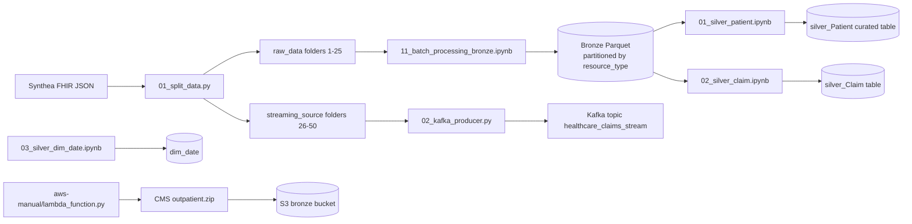

# Healthcare Data Engineering

End-to-end healthcare data engineering project using synthetic FHIR data, PySpark, and a local medallion-style data lake (`bronze`, `silver`, `gold`).

The project currently focuses on batch ingestion and silver-layer transformations, with supporting assets for Kafka streaming and AWS Lambda ingestion.

## Project Overview

This repository combines three main data sources and workflows:

1. Synthetic patient data generated by Synthea (`synthea/output/fhir/*.json`)
2. Batch processing of FHIR bundles into a Bronze and Silver data lake
3. External claims data ingestion example through an AWS Lambda (CMS Outpatient ZIP -> S3)

# Repository Structure

```text

├── healthcare_de_project/
│   ├── docker-compose.yml
│   ├── data_lake/
│   │   ├── bronze/
│   │   ├── silver/
│   │   └── gold/
│   ├── raw_data/
│   ├── streaming_source/
│   └── scripts/
│       ├── 01_split_data.py
│       ├── 02_kafka_producer.py
│       ├── 11_batch_processing_bronze.ipynb
│       ├── 12_processing_silver.ipynb
│       └── silver_notebooks/
│           ├── 01_silver_patient.ipynb
│           ├── 02_silver_claim.ipynb
│           └── 03_silver_dim_date.ipynb
├── proofs/
└── synthea/
```

## Architecture



## Tech Stack

- Python 3.x
- Apache Spark (PySpark)
- Jupyter notebooks (VS Code)
- Apache Kafka (Confluent image via Docker Compose)
- Synthea synthetic data generator (Java/Gradle project)

## Data Lake Layers

### Bronze

- Notebook: `healthcare_de_project/scripts/11_batch_processing_bronze.ipynb`
- Input: `healthcare_de_project/raw_data/folder_*/*.json`
- Output: `healthcare_de_project/data_lake/bronze/batch_data/`
- Behavior:

  - Reads FHIR bundle JSON files as `binaryFile`
  - Extracts `entry` array and flattens entries
  - Captures metadata (`input_file_name`, `ingestion_timestamp`)
  - Writes Parquet partitioned by `resource_type`

### Silver (Curated Domain Tables)

- Patient notebook: `healthcare_de_project/scripts/silver_notebooks/01_silver_patient.ipynb`

  - Input: `resource_type=Patient`
  - Output: `healthcare_de_project/data_lake/silver/silver_Patient/`
  - Curates demographics, identifiers, contact fields, language, geolocation, and audit timestamp
- Claim notebook: `healthcare_de_project/scripts/silver_notebooks/02_silver_claim.ipynb`

  - Input: `resource_type=Claim`
  - Output: `healthcare_de_project/data_lake/silver/silver_Claim/`
  - Extracts common claim-level fields (status, type, use, patient reference, period, diagnosis, items, totals)
- Date dimension notebook: `healthcare_de_project/scripts/silver_notebooks/03_silver_dim_date.ipynb`

  - Output: `healthcare_de_project/data_lake/silver/dim_date`
  - Builds date dimension rows from 1970-01-01 to 2040-12-31

## Local Setup

### 1. Clone Repository

```bash
git clone https://github.com/Hariprasad-b-s/healthcare-data-engineering.git
cd healthcare-data-engineering
```

### 2. Generate Synthetic Data (Synthea)

From the `synthea` directory:

```bash
git clone https://github.com/synthetichealth/synthea.git
cd synthea
./run_synthea -p 100
cd ..
```

This generates FHIR JSON bundles under `synthea/output/fhir/`.

### 3. Split Data into Batch and Streaming Folders

```bash
cd healthcare_de_project/scripts
python 01_split_data.py
cd ../..
```

Expected behavior:

- Creates folders `raw_data/folder_1..folder_25`
- Creates folders `streaming_source/folder_26..folder_50`
- Randomly distributes JSON files across all 50 folders

### 4. Start Kafka Locally (Optional Streaming Setup)

```bash
cd healthcare_de_project
docker compose up -d
cd ..
```

Kafka broker is exposed at `localhost:9092`.

### 5. Run Batch-to-Lake Notebooks

Open and run these notebooks in order:

1. `healthcare_de_project/scripts/11_batch_processing_bronze.ipynb`
2. `healthcare_de_project/scripts/silver_notebooks/01_silver_patient.ipynb`
3. `healthcare_de_project/scripts/silver_notebooks/02_silver_claim.ipynb`
4. `healthcare_de_project/scripts/silver_notebooks/03_silver_dim_date.ipynb`

## AWS Manual Ingestion (CMS Example)

File: `aws-manual/lambda/lambda_function.py`

What it does:

1. Downloads a CMS Outpatient ZIP file from `data.cms.gov`
2. Extracts CSV files in-memory
3. Uploads each CSV to S3 path:
   `cms/outpatient/year=<YYYY>/month=<MM>/<filename>`

Default bucket in script: `hari-healthcare-bronze-raw`

## Streaming Notes

File: `healthcare_de_project/scripts/02_kafka_producer.py`

- Topic configured: `healthcare_claims_stream`
- Reads JSON files from `streaming_source/folder_*`
- Current script is incomplete and needs producer initialization and `send` logic before production use

## Current Status

- Implemented:

  - Synthetic data generation source (Synthea)
  - Batch ingestion to Bronze
  - Curated Silver transformations
  - Date dimension generation
  - Local Kafka service configuration
  - Example AWS Lambda ingestion flow for CMS data
- In progress / next improvements:

  - Finalize Kafka producer script
  - Add streaming consumer and Bronze streaming sink
  - Add Gold-layer marts in `data_lake/gold`
  - Add dependency/environment files (`requirements.txt` or `environment.yml`)
  - Add data quality checks and tests

## Troubleshooting

- `SparkArrayIndexOutOfBoundsException`:

  - Use null-safe extraction (`element_at`, `get`) instead of direct `[0]` indexing on arrays.
- `CANNOT_CONVERT_COLUMN_INTO_BOOL`:

  - Do not use Python `if` with Spark Columns.
  - Use `F.when(...).otherwise(...)` for DataFrame expressions.
- Truncated Spark plan warning:

  - Increase debug field limit if needed:
  - `spark.conf.set("spark.sql.debug.maxToStringFields", 2000)`

## License

This repository contains custom project code and a vendored `synthea` project (Apache 2.0). Respect the license files in `synthea/LICENSE` and `synthea/NOTICE` when redistributing.
